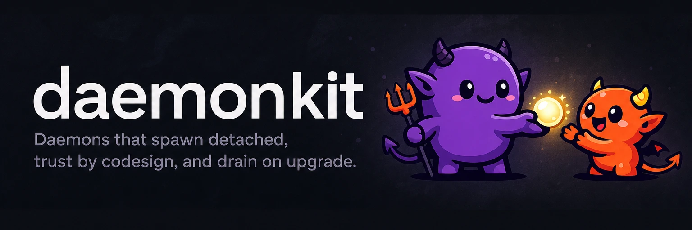

# 

**Daemons that spawn detached, trust by codesign, and drain on upgrade.** daemonkit is the daemon + signed-app pattern extracted from fusekit, claude-pool, cc-interact, and synckit, shipped as one Go module and one Swift package.

[](https://github.com/yasyf/daemonkit/actions/workflows/ci.yml)
[](https://github.com/yasyf/daemonkit/blob/main/LICENSE)

## Get started

```bash
go get github.com/yasyf/daemonkit@latest
```

```text
go: added github.com/yasyf/daemonkit v<version>
```

<details>
<summary>Swift (SPM)</summary>

Add the package to your dependencies and link the `DaemonKit` library product into your app or helper target:

```swift
.package(url: "https://github.com/yasyf/daemonkit", exact: "0.3.1"),
```

</details>

Driving with an agent? Paste this:

```text
Add github.com/yasyf/daemonkit to my Go module (go get github.com/yasyf/daemonkit@latest),
check the package table in its README for what has landed, and replace this repo's
hand-rolled daemon lifecycle (spawn, singleton socket, version takeover) with
daemonkit's primitives.
```

---

## Use cases

### Hold a resource through `kill -9`

A daemon that owns kernel state — a FUSE mount, a keychain session — can't ride its parent's lifetime. Spawn it detached (new session, closed fds, a flock held for the listener's life) and the resource survives the CLI, the terminal, and the login session that started it. fusekit's mount holder has run this way in production since day one; `proc` is that machinery, extracted.

### Retire the old daemon when a new version ships

Two versions of the same daemon meet on one socket after every upgrade. The kit's answer: probe health and version first, never evict a tie, hand off when the peer advertises it, and treat "I couldn't tell" as "do nothing" — a busy daemon holding real resources is never killed for being older. Draining hands the old daemon's work to the new one instead of dropping it.

### Trust the process on the other end of the socket

A unix socket's permission bits say which UID connected, not which binary. On macOS, daemonkit's trust check resolves the peer's audit token to its code signature and pins team + signing identifier — same-team-but-different-tool is rejected, and a configured requirement with no verifier fails closed.

## The packages

One row per package; the Status column is each surface's live state.

| Surface | Owns | Status |
|---|---|---|
| `proc` | Detached spawn, single-entrant sockets, process caps, child reaping, exact epoch-1 durable process ledger | Landed |
| `service` | `Agent` LaunchAgent lifecycle with required typed restart policy and exact epoch-1 controller state, installed in bootout, bootstrap, enable, kickstart order, plus the `AppKeepAlive` agent (`open -g -W`) for signed holder apps | Landed |
| `version` | Release/dev version taxonomy, newest-wins skew | Landed |
| `paths` | The `~/<app>` state layout: daemon socket, HTTP handshake file, per-subject artifacts, start lock, sqlite database, daemon log, turn-snapshot scratch dirs | Landed |
| `bundle` | Info.plist reads, stable `.app` path conventions | Landed |
| `wire` | Exact-v1 persistent session transport, bounded multiplexing and delivery, peer credentials | Landed |
| `wire/lifeproto` | The exact-v1 frozen lifecycle envelope (health, shutdown, hello, handoff) — Go and Swift bindings generated from one schema, pinned byte-identical by a shared golden fixture | Landed |
| `trust` | Codesign peer verification (audit-token designated requirements) | Landed |
| `daemon` | Takeover ladder, skew watch, idle exit | Landed |
| `drain` | Drain-on-upgrade: journals, fences, dead-peer adoption | Landed |
| `supervise` | Bounded disposable workers and managed long-lived process handles with pre-exec durable identity, readiness gating, cancellation settlement, and cross-generation orphan recovery | Landed |
| `Sources/DaemonKit` | Swift: signed-process App Group resolution, socket serving, peer trust (same-UID floor + designated-requirement pinning), `SMAppService` login items, snapshot watching | Landed |

The LaunchAgents `service` writes use no socket activation — the daemon binds and flocks its own socket (`proc`); launchd only keeps the process alive. Every `Agent` and `AppKeepAlive` selects `RestartAlways`, `RestartOnFailure`, or `NoRestart`; the policy is rendered directly into the launchd plist. On the Swift side, `DaemonKit` reconciles `SMAppService` login items (opening the Login Items settings pane when the item needs approval), watches snapshot directories, and rides the signed `.app` bundle for a stable bundle + TCC identity.

Status: v0.3.1 is the hard-cut release line consumed by FuseKit and the manually
migrated fleet. Protocol and durable-state epochs begin at 1 with exact equality;
the API stabilizes at v1.0.0.

Licensed under [PolyForm-Noncommercial-1.0.0](LICENSE).
