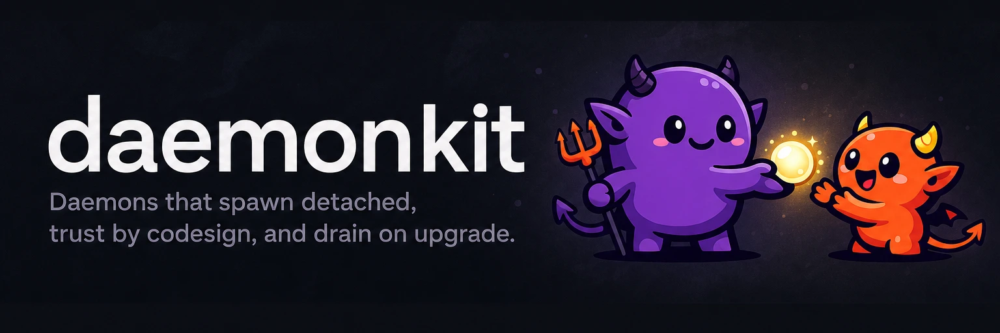

# 

**Daemons that spawn detached, trust by codesign, and drain on upgrade.** daemonkit is the daemon + signed-app pattern extracted from fusekit, claude-pool, cc-interact, and synckit, shipped as one Go module and one Swift package. It is macOS-only. The trust, process, and service layers read kernel state directly, so the module does not compile off darwin.

[](https://github.com/yasyf/daemonkit/actions/workflows/ci.yml)
[](https://github.com/yasyf/daemonkit/blob/main/LICENSE)

## Get started

```bash
go get github.com/yasyf/daemonkit@latest
```

```text
go: added github.com/yasyf/daemonkit v<version>
```

<details>
<summary>Swift (SPM)</summary>

Add the package to your dependencies and link the `DaemonKit` library product into your app or helper target:

```swift
.package(url: "https://github.com/yasyf/daemonkit", exact: "0.20.10"),
```

</details>

Driving with an agent? Paste this:

```text
Add github.com/yasyf/daemonkit to my Go module (go get github.com/yasyf/daemonkit@latest),
check the package table in its README for what has landed, and replace this repo's
hand-rolled daemon process ownership (spawn, exclusive socket, drain, stop control) with
daemonkit's primitives.
```

---

## Use cases

### Hold a resource through `kill -9`

A daemon that owns kernel state — a FUSE mount, a keychain session — can't ride its parent's lifetime. Spawn it detached (new session, closed fds, a flock held for the listener's life) and the resource survives the CLI, the terminal, and the login session that started it. fusekit's mount holder has run this way in production since day one; `proc` is that machinery, extracted.

### Retire the old daemon when a new version ships

The service controller observes the product's typed runtime health, starts an
exact hidden role from the fixed executable, and durably authorizes that one
process to call `daemon.control.stop`. The runtime validates and consumes the
one-shot authority before draining. The controller waits for both the endpoint
and exact process identity to settle before it starts the replacement.

### Trust the process on the other end of the socket

A unix socket's permission bits say which UID connected, not which binary. daemonkit's trust check resolves the peer's audit token to its code signature and pins team + signing identifier — same-team-but-different-tool is rejected, and a configured requirement with no verifier fails closed.

### Own a typed Swift service generation

`StaticSessionServiceRuntime<Request, Response>` binds one exact Unix socket,
checks the peer's effective UID and role before admission, publishes Ready only
after the typed route exists, and drains every accepted request before unlinking
the listener. Products provide their codec, operation, tenant, handler, and
resource limits; daemonkit owns lifecycle controls, framing, backpressure,
cancellation, settlement, and authenticated successor following.

## The packages

Each row below is read out of the tree by `scripts/gen-package-table.sh` — the
package's own godoc summary and its file and line counts. CI regenerates the
table and fails the build when it drifts from disk, so a package that ships or
disappears cannot leave a stale row behind.

<!-- BEGIN GENERATED: package table (scripts/gen-package-table.sh) -->
| Package | Owns | Files | Lines |
|---|---|---|---|
| `artifact` | resolves a version-exact executable from a declarative descriptor, for the cc-family's one central "give me the binary that matches my version" primitive. | 16 | 2227 |
| `bundle` | reads a macOS .app's Info.plist and resolves the stable bundle paths a daemon installs to. | 5 | 198 |
| `deploy` | owns sealed installation, activation, supersession, and removal of one fixed signed application. | 16 | 5934 |
| `durable` | makes filesystem state survive crashes: atomic, fsynced publication of files and directory mutations, a strict validated JSON codec, and one bounded cross-process lock. | 9 | 1029 |
| `ghrelease` | queries GitHub for a repository's latest published release. | 2 | 170 |
| `launchd` | is the value-type model for one exact macOS user LaunchAgent and the stateless primitives that apply it. | 12 | 2675 |
| `paths` | owns the canonical state-directory layout under the user's home directory, resolved through the passwd database — never the caller's HOME or CLAUDE_CONFIG_DIR — so a sandboxed environment cannot relocate state. | 4 | 278 |
| `templates` | — | 2 | 218 |
| `version` | classifies and compares release and development builds for launcher-owned runtime settlement and release ordering. | 2 | 302 |
<!-- END GENERATED: package table -->

Packages under `internal/` are module-private machinery and carry no compatibility
promise; they are left out of the table on purpose.

The Swift half lives in `Sources/DaemonKit`: typed static service runtimes,
generation-aware service clients, signed-process App Group resolution, peer trust
(a same-UID floor plus designated-requirement pinning), `SMAppService` login
items, and snapshot watching.

The LaunchAgents `service` writes use no socket activation — the daemon binds and flocks its own socket (`proc`); launchd only keeps the process alive. Every `Agent` and `AppKeepAlive` selects `RestartAlways`, `RestartOnFailure`, or `NoRestart`; the policy is rendered directly into the launchd plist. On the Swift side, `DaemonKit` reconciles `SMAppService` login items (opening the Login Items settings pane when the item needs approval), watches snapshot directories, and rides the signed `.app` bundle for a stable bundle + TCC identity.

`BrokerSocketBridge` requires a lifecycle `RuntimeClientConfiguration` and a
distinct, nonempty `handoffRole`. The lifecycle session is limited to receipt
and readiness preflight. A separate persistent handoff session sends only
`daemon.broker-handoff.v1`, pinned to the exact ready-runtime receipt. There is
no single-role or compatibility initializer.

`deploy` never downloads an application. Packaging supplies one exact local
signed `.app`: a `Candidate` names it by source path, exact version, and
bundle-tree digest, and its bytes are copied into a private slot beside the
canonical path, never moved from under the caller. `deploy.Open` binds a
`Config` — the canonical `.app` path, the trusted-publisher requirement, the
daemon, and the exact LaunchAgent set — into a `Deployment`, one application's
sealed lifecycle. `Install` lands the first generation and refuses an occupied
canonical path; `Supersede` proves the incumbent gone and its executables
empty, then swaps as one recorded rename pair, so a crash anywhere in the
middle resumes to the same end. `Activate` converges launchd to the agent set
and seals what the started daemon proves about itself; `Uninstall` quiesces,
converges the services away, and removes the app whole-to-absent in one rename;
`Reset` is the way out of a state no other verb accepts. Consumers never touch
the private stage, swap the installed app, inspect the records' JSON, or remove
the canonical app. Exact v1 receipts, service state, and locks live beside the
app under `.daemonkit-deploy/<Product>`.

## The consumer trust contract

Peer verification is a handful of kernel reads against the accepted socket's
audit token, in the daemon's own process. A product owes it nothing: no child
verb to dispatch, no worker lane to size, no framework to load. Declare what a
peer must prove and daemonkit enforces it in the acceptor:

```go
daemonkit.Daemon{
	Label: "com.example.broker",
	Trust: daemonkit.Trust{
		Control: &daemonkit.Requirement{
			TeamID:            "ABCDE12345",
			SigningIdentifier: "com.example.broker.helper",
		},
	},
}
```

The same-effective-UID floor runs first, unconditionally, for every peer; no
`Trust` value can express its absence. A configured `Requirement` on a build
with no verifier — a `daemonkit_unsigned` build — is denied outright rather
than downgraded to UID-only. What the check proves, and what it does not, is
`Requirement`'s documented contract: it authenticates the peer's main Mach-O as
a program a team signed under an identifier, not the product you installed, not
an up-to-date build, and not a principal.

Status: the module is pre-1.0 and hard-cut — no release carries a compatibility
shim for the one before it. Protocol and durable-state epochs begin at 1 with
exact equality; the API stabilizes at v1.0.0.

Licensed under [PolyForm-Noncommercial-1.0.0](LICENSE).
